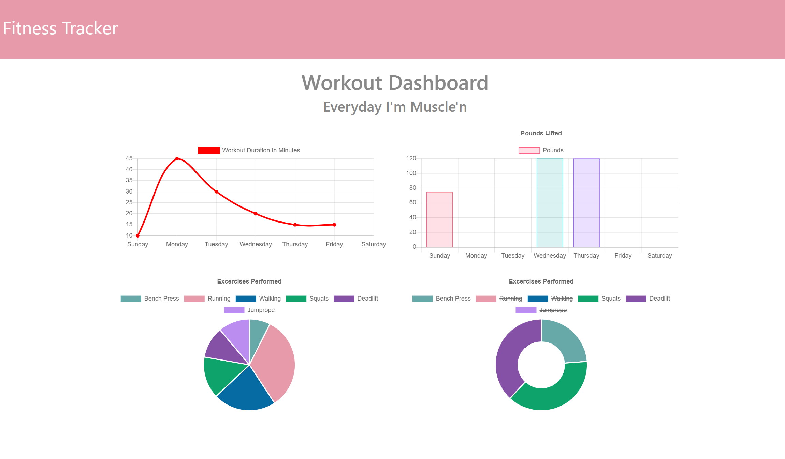

# Fitness_Tracker

## Table of Contents
* [Description](#Description)
* [Features](#Preview)
* [Installation](#Installation)
* [Technologies](#Technologies)
* [Credits](#Credits)
* [Contribution](#Contribution)
* [Links](#Links)

## Description
Fitness Tracker allows users to keep a record of their daily workout. Various attributes such as distance, pounds, duration, and the type of workout may be saved. Don't let those pumps of iron go to waste, and track your gains today!


## Features
* Keep track of past and present workouts
* Fitness Dashboard provides graphs that track weekly performance
* Distance, pounds, and duration or workouts may be saved
* The resume may be downloaded by clicking on the image.


## Installation
1. Clone Repository
2. Open desired terminal
3. Run the following command:
```
npm install
```
## Technologies 
* HTML
* CSS
* JavaScript
* Bootstrap
* MongoDb
* Heroku

## Credits
The front-end of this code was provided by Trilogy Education.

## Contribution
Direct any questions, comments, or issues to:
[andal-a] [Email](mailto:aandal77@gmail.com) | [GitHub Profile](https://www.github.com/andal-a)

## Links
[Start Your Fitness Journey](https://andal-a.github.io/Fitness_Tracker/)